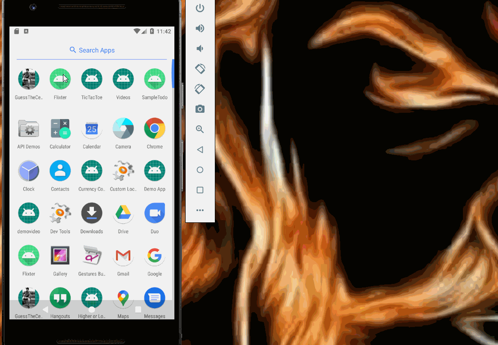

# Project 1 - *Flicks App*

**Flicks** is an android app that allows user to view a list of movies (title, poster image, and overview) currently playing in theaters from the Movie Database API

Submitted by: **Sajjan Kumar**

Time spent: **4** hours spent in total

## User Stories

The following **required** functionality is completed:

* [X] Networking and parsing JSON.
* [X] Recyclerview implementation.
* [X] Handle cases for protrait and landscape modes.

## Video Walkthrough

Here's a walkthrough of implemented user stories:

GIF created with [LiceCap](http://www.cockos.com/licecap/).

## Notes

Describe any challenges encountered while building the app.
Using different version of recycler view behaves differently. I had to figure out the error. 

Different api level behave differently.

## License

    Copyright [2021 ] [Sajjan Kumar]

    Licensed under the Apache License, Version 2.0 (the "License");
    you may not use this file except in compliance with the License.
    You may obtain a copy of the License at

        http://www.apache.org/licenses/LICENSE-2.0

    Unless required by applicable law or agreed to in writing, software
    distributed under the License is distributed on an "AS IS" BASIS,
    WITHOUT WARRANTIES OR CONDITIONS OF ANY KIND, either express or implied.
    See the License for the specific language governing permissions and
    limitations under the License.
